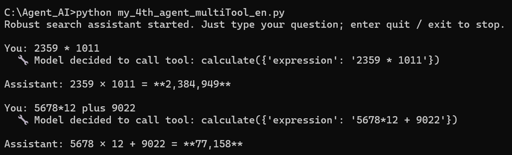
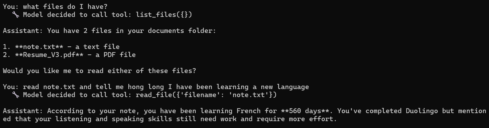

# Multi-Tool AI Agent (from scratch, no framework)

A hand-written AI agent that decides which tools to call, and in what order, to answer a
question — built directly on the Anthropic API with **no agent framework**. It can search
the web, scrape a page's full text, do exact arithmetic, and answer questions about my local
documents.

I built this to understand how agents actually work underneath, rather than letting a
framework hide the loop from me. The core decision loop is ~30 lines; everything else is
tools and guardrails.

## What it can do

The agent has five tools and chooses among them on its own:

| Tool | What it does |
|------|--------------|
| `web_search` | Searches the web (via Tavily) for current information |
| `fetch_page` | Scrapes the body text of a specific URL — for reading a full article after search |
| `calculate` | Exact arithmetic via safe AST evaluation (**not `eval`** — see "What I learned") |
| `list_files` | Lists the documents available in a local `my_docs/` folder |
| `read_file` | Reads a document's text (plain text + PDF) to answer questions about it |

Two-tool patterns emerge naturally: the model learns to go `web_search → fetch_page`
("find a link, then read it") and `list_files → read_file` ("see what's there, then read
the right one") without being told the order — it infers it from the tool descriptions.

## Demo

> Exact arithmetic — the model is forced to delegate to the tool instead of computing in its head:



> Document Q&A — the model discovers local files, reads the relevant one, and answers from its contents:



## How to run

```bash
pip install anthropic tavily-python requests beautifulsoup4 pypdf
```

Set your API keys as **environment variables** (never hard-coded, never committed):

```bash
# macOS / Linux
export ANTHROPIC_API_KEY="your-key"
export TAVILY_API_KEY="your-key"

# Windows (PowerShell)
setx ANTHROPIC_API_KEY "your-key"
setx TAVILY_API_KEY "your-key"
```

Then:

```bash
python my_4th_agent_multiTool_en.py
```

To try the document tools, create a `my_docs/` folder next to the script and drop a `.txt`
or `.pdf` file into it, then ask the agent about its contents.

## How it's built

The whole thing is one loop: the model returns either a final answer or a request to call a
tool; if it's a tool call, the agent runs the tool, hands the result back, and loops again.
Adding a new capability means adding a tool function plus two registrations (its description
for the model, and a name→function mapping) — **the loop itself never changes.**

Robustness was added deliberately, layer by layer:

- **Dynamic date** injected into the system prompt, so the agent never reasons from a stale
  hard-coded date.
- **System prompt** that tells the model to trust search results over its own memory.
- **Cross-question memory** so follow-up questions work in one session.
- **Per-tool `try/except`** — a failing tool returns the error *as a result* to the model
  rather than crashing, so the model can explain or retry.
- **Max-rounds cap** to stop runaway tool loops from burning tokens.
- **Model-call failure handling** with history rollback, so a dropped connection mid-turn
  doesn't corrupt the conversation state.

## What I learned

These are the observations that made this project worth building:

- **Reliability comes from delegating to deterministic tools, not from persuading the
  model.** When asked to multiply two large numbers without a tool, the model confidently
  produced a *wrong* answer; when challenged, it apologized and produced *another* wrong
  answer. It could not verify its own correctness. The fix wasn't a better prompt — it was
  handing the work to a calculator tool.

- **A strict tool description changes the model's default behavior.** After adding "even if
  it looks trivial, do not compute in your head" to the calculator's description, the model
  began routing even `2 + 5` through the tool — while still noting it *could* have answered
  directly. The instruction overrode its instinct. Constraint works where conversation
  doesn't.

- **"Discover then read" is one reusable pattern.** `web_search → fetch_page` and
  `list_files → read_file` are the same shape. Swapping the toolset changes the *scenario*
  (web research vs. document Q&A) while the agent loop stays identical — which is the whole
  point of designing around tools.

- **Untrusted input flowing into a tool needs a guardrail.** The calculator uses AST parsing
  with an operator whitelist instead of `eval`, because this agent also scrapes web pages —
  a malicious string disguised as an expression could otherwise execute arbitrary code. The
  file reader locks paths inside `my_docs/` to block `../../` path-traversal. Same lesson,
  two layers.

- **Errors are layered, and each layer needs its own defense.** A tool failing, the model
  being unreachable, and a bug in my own code are three different failures that must be
  handled in different places — and the exception *type* is what tells them apart.

## Files

- `my_4th_agent_multiTool_en.py` — the agent
- `agent_learning_plan.md` — my week-by-week learning plan and notes
