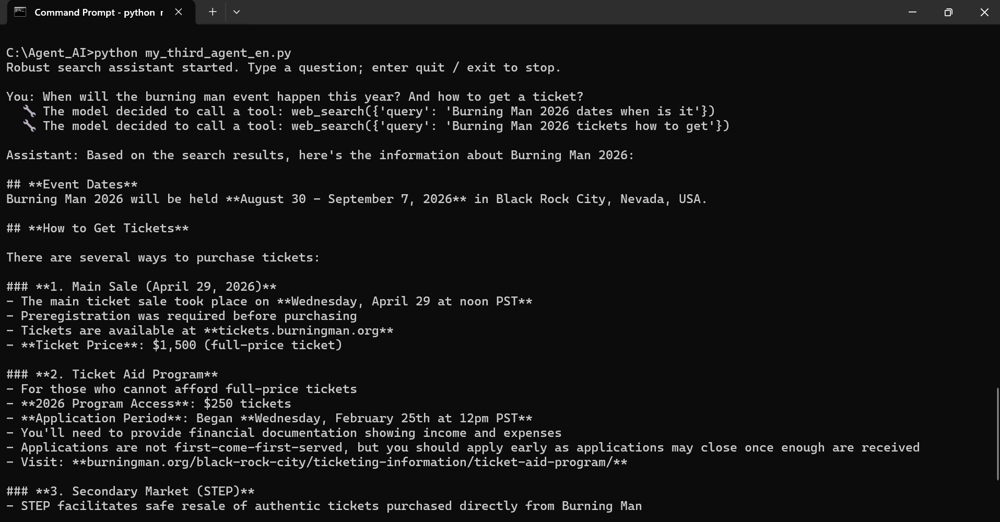

# Search Agent

A small but robust command-line AI agent that answers questions by searching the web in real time. Built from scratch on the Anthropic API and Tavily search to understand how tool-using agents actually work: the model decides *when* to search, the code runs the search, and the result is fed back to the model to answer.

## What it does

Ask it anything in the terminal. When a question needs current information, the agent calls a web-search tool, reads the results, and answers based on them — instead of relying on the model's (possibly outdated) training data. You can ask follow-up questions and it remembers the conversation.

## Features

- **Live web search** via Tavily — answers reflect current information, not stale training data.
- **Multi-turn memory** — ask follow-ups ("what about ...?") and it keeps context.
- **Dynamic date awareness** — the model always knows today's date, so it searches for the right year.
- **Graceful tool failures** — if a search fails, the agent says so honestly instead of crashing or making things up.
- **Network-failure recovery** — if the model is unreachable, the current turn is aborted and history is rolled back, so the program stays alive and the conversation is preserved.
- **Loop guard** — a max-rounds cap prevents runaway tool calls from burning tokens.

## Setup

1. Install dependencies:
   ```
   pip install anthropic tavily-python
   ```
2. Set your API keys as environment variables (the code never stores keys in source):
   - `ANTHROPIC_API_KEY`
   - `TAVILY_API_KEY`

## Usage

```
python my_third_agent_en.py
```

Then type your questions. Enter `quit` or `exit` to stop.

## Demo



## Notes

This is a learning project. The agent loop is hand-written (no framework) on purpose, to understand the core "model decides → tool runs → result returns" cycle from the ground up.
